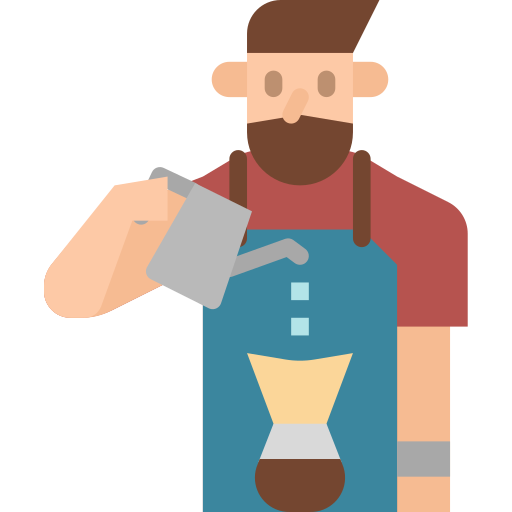

# barista
### Scripts for scaffolding components and utils for coffee-barista

 - create a component:
    `barista create component <component-name>`

 - create a util:
    `barista create util <util-name>`
    
 - add a `--no-typescript` flag to either for es6 javascript
---

### .baristarc.json
***you can configure barista by placing a .baristarc.json wherever you're calling it from***

 - storybook: defaults to true
 - typescript: defaults to true
 - organisation_name: defaults to empty string
 - packages_dir: defaults to .
---

### command line flags
**these will overwrite your .baristarc.json config**

- `--no-typescript`
- `--no-storybook`
- `organisation-name`
- `packages-dir`
